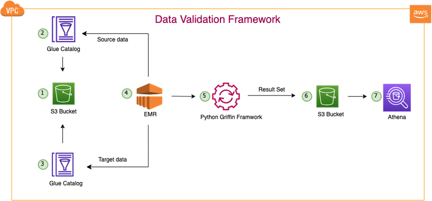
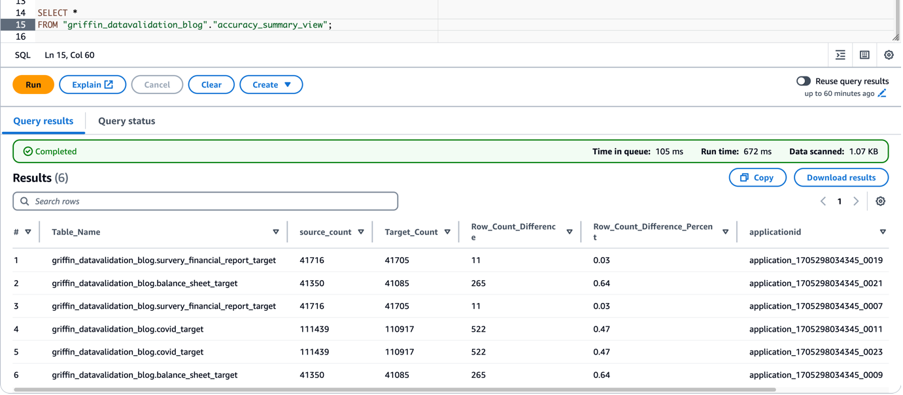
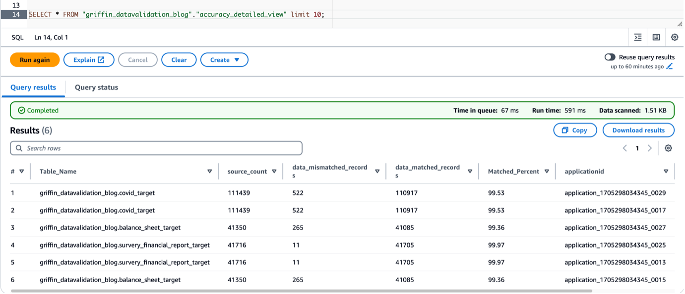
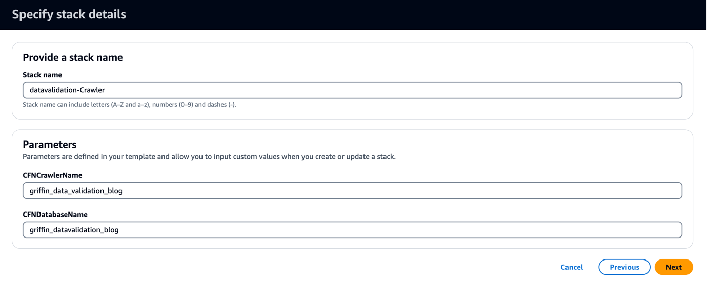
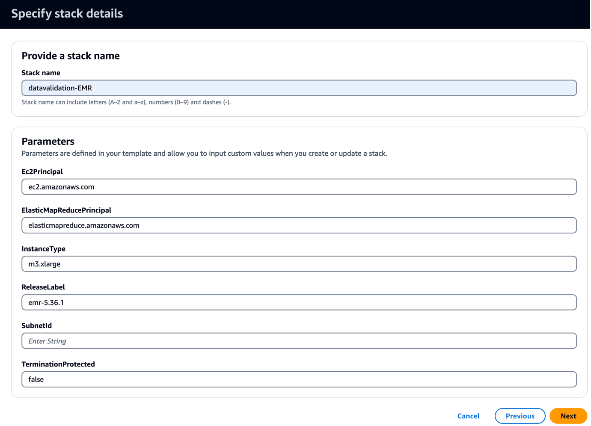
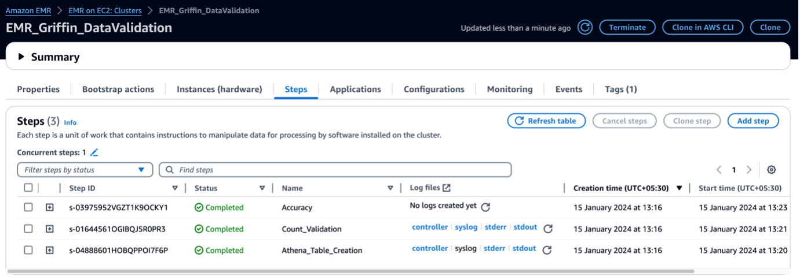

# Automated Data Validation Framework User Guide

## Overview:

In migration projects a significant time is spent in doing the data validation and lot of manual efforts being spent. 

The framework developed helps to simplifying this problem by:
- It will help to automate full data validation with some simple config files.
- It will run the framework on EMR and create summary and detail data validation report in S3 and show up on Athena tables.

Only initial effort is to setup this framework and create config files which has table names to compare.

## Visual 1: Architecture.

## Visual 2: Summary Validation Report.

## Visual 3: Detailed Validation Report.

## For Detailed Deployment Instructions and Runbook

<b>Folder Level info</b>
       
1. `data` : It has sample data for each table for your inital understanding.
2. `total_count` : Framework will generate count validation results in this folder.
3. `accuracy` : Framework will generate full data row/columm validation results in this folder.
4. `mismatched_records` : Framework will place the files in this folder, if source and target data has some mismatches.
5. `datavalidation` : This folder has all the initial setup files and jars needed to deploy the solution.

## Deploy the solution:

1.	Create an S3 bucket in your AWS account called bdb-3070-griffin-datavalidation-blog-${AWS::AccountId}-${AWS::Region} (provide your AWS account ID and AWS Region).
2. Download all the folders and files in this git to your local folder.
3. Change <bucket name> with the one you created in your account (bdb-3070-griffin-datavalidation-blog-${AWS::AccountId}-${AWS::Region}) in the following files:
	-	bootstrap-bdb-3070-datavalidation.sh
	-	Validation_Metrics_Athena_tables.hql
	-	datavalidation/totalcount/totalcount_input.txt
	-	datavalidation/accuracy/accuracy_input.txt
4. Upload all the folders and files in this .zip file to your S3 bucket:
	a. aws s3 cp . s3://<bucket_name>/ --recursive
5.	Run the following CloudFormation template in your account.
	a. The CloudFormation template creates a database called griffin_datavalidation_blog and an AWS Glue crawler called griffin_data_validation_blog on top of the data folder in the .zip file
6. Choose Next.

   

7.	Choose Next again.
8.	On the Review page, select I acknowledge that AWS CloudFormation might create IAM resources with custom names.
9.	Choose Create stack.

	-	You can view the stack outputs on the AWS Management Console or by using the following AWS Command Line Interface (AWS CLI) command:

	aws cloudformation describe-stacks --stack-name <stack-name> --region us-east-1 --query Stacks[0].Outputs 

10.	Run the AWS Glue crawler and verify that six tables have been created in the AWS Glue Data Catalog.
11.	Run the following CloudFormation template in your account - Griffin_Data_Validation_EMR_Cluster.yml

	This template creates an EMR cluster with a bootstrap script to copy Griffin-related JARs and artifacts. It also runs three EMR steps:

	•	Create two Athena tables and two Athena views to see the validation matrix produced by the Griffin framework
	•	Run count validation for all three tables to compare between the source and target table
	•	Run record-level and column-level validations for all three tables to compare between the source and target table

12.	Choose Next and fill your environment EC2 Public subnet ID.

	

13.	Choose Next again.
14.	On the Review page, select I acknowledge that AWS CloudFormation might create IAM resources with custom names.
15.	Choose Create stack.

	You can view the stack outputs on the console or by using the following AWS CLI command:

	aws cloudformation describe-stacks --stack-name <stack-name> --region us-east-1 --query Stacks[0].Outputs 

	It takes approximately 5 minutes for the deployment to complete. When the stack is complete, you should see the EMRCluster resource launched and available in your account. 

	When the EMR cluster is launched, it runs the following steps as part of the post-cluster launch:

	-	Bootstrap action – Installs the Griffin JAR file and directories for this framework. It also downloads sample data files to use in the next step.
	-	Athena_Table_Creation – Creates tables in Athena to read the result reports. 
	-	Count_Validation – Runs the job to compare the data count between source and target data from the AWS Glue Data Catalog table and store the results in an S3 bucket, which will be read via an Athena table.
	-	Accuracy – Runs the job to compare the data rows between the source and target data from the AWS Glue Data Catalog table and store the results in an S3 bucket, which will be read via the Athena table.

	

	When the EMR steps are complete, your table comparison is done and ready to view in Athena automatically. No manual intervention is needed for validation.

	The following screenshots are a preview of sample data from the source and target table comparison.

	Validate data with Python Griffin

	When your EMR cluster is ready and all the jobs are complete, it means the count validation and data validation are complete. The results have been stored in Amazon S3 and the Athena table is already created on top of that. You can query the Athena tables to view the results, as shown in the following screenshot.

	Verify data validation results with Athena
	
	The following screenshot shows the count results for all tables.

	

	The following screenshot shows the data accuracy results for all tables.

	
       
## Security

See [CONTRIBUTING](CONTRIBUTING.md#security-issue-notifications) for more information.

## License

This project is licensed under the MIT-0 License.
